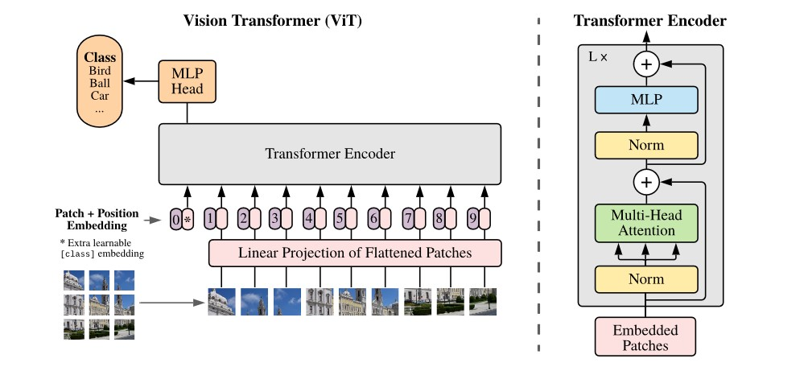
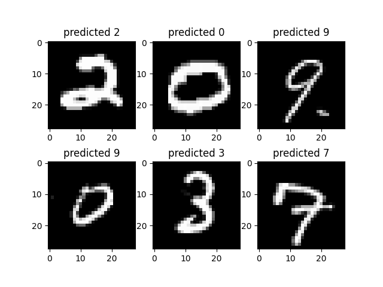

# ViT
"ViT_from_scratch.py" is a simple implementation of ViT from scratch. The Transformer Encoder is from nn Module. 
The dataset is available [here](https://www.kaggle.com/competitions/digit-recognizer/data). You can read more from the original [paper](https://arxiv.org/pdf/2010.11929).   
"vit-mnist.ipynb" is a more detailed implementation of ViT. The Transformer Encoder is implemented from scratch.

## ViT architecture

## Predicted results
